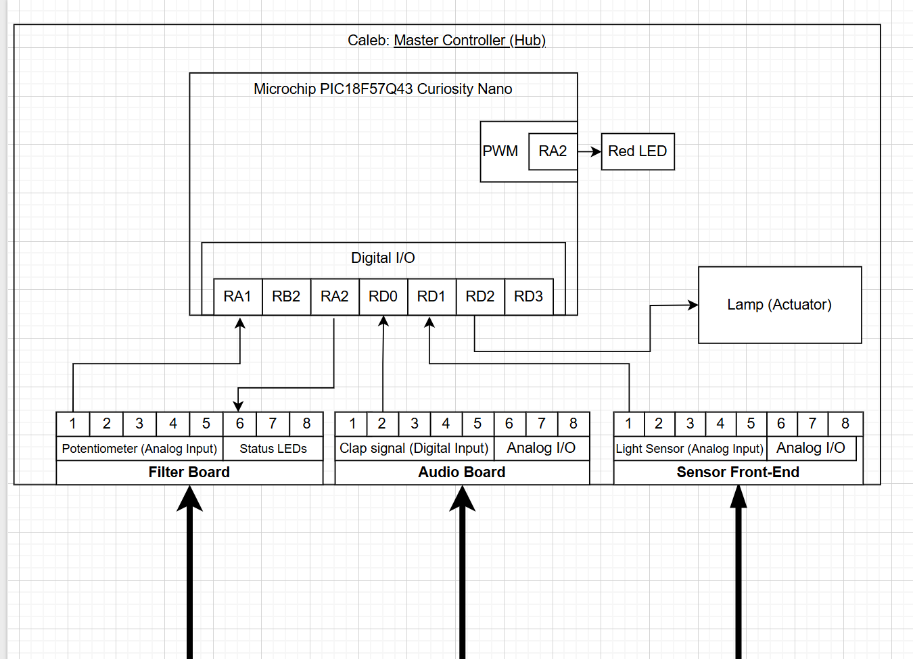

**Team 204 – Clap-Activated Smart Light**  
**Caleb Yuen – Master Controller (Hub)**  

## Overview
This page describes the hardware layout of my subsystem (Hub) for the team clap-activated light project. The Master Controller (PIC18F57Q43 Curiosity Nano) processes sensor data from the Audio, Filter, and Sensor Front-End boards, then drives the actuator to control the lamp output. The design uses an 8-pin ribbon-cable standard for consistent power and signal connections across all subsystems.

## Block Diagram 

**Microcontroller:** Microchip PIC18F57Q43 Curiosity Nano  

**Inputs:**  
- Clap signal (from Audio board)
- UI button (from UI board)
- Lamp toggle (from UI board)

**Outputs:**  
- Status LED (to UI board)
- Heartbeat LED (on Hub)
- Actuator control to Output Driver (TB6612): PWM_MOTOR, MOTOR_IN1, MOTOR_IN2, MOTOR_STBY

**Communication:** Discrete GPIO over ribbon; no I²C in Rev 1. 
**Power:** 9 V DC in → 5 V (LM7805) → 3.3 V logic; common GND shared across all boards  

## Pin Assignment Table
| Pin | Signal             | Direction         | Source → Destination     | MCU Pin (PIC18F57Q43) | Voltage | Notes |
|-----|--------------------|------------------|--------------------------|------------------------|----------|-------|
| 1   | GND                | —                | —                        | —                      | 0 V      | Common ground reference across all subsystems |
| 2   | +5V_SYS            | —                | Power Supply → All Boards | —                      | 5 V      | Regulated output from LM7805 |
| 3   | CLAP_IN            | Input             | Audio → Hub              | (assign pin)           | 3.3 V (via divider) | Clap detection digital signal |
| 4   | UI_BUTTON_IN       | Input             | UI → Hub                 | (assign pin)           | 3.3 V (via divider) | User button input |
| 5   | LAMP_TOGGLE        | Input             | UI → Hub                 | (assign pin)           | 3.3 V (via divider) | Light toggle control |
| 6   | UI_STATUS_LED      | Output            | Hub → UI                 | (assign pin)           | 3.3 V     | Status indicator LED |
| 7   | PWM_MOTOR          | Output (PWM)      | Hub → Output Driver      | (assign pin)           | 3.3 V     | Lamp or motor dimming signal |
| 8   | MOTOR_STBY         | Output            | Hub → Output Driver      | (assign pin)           | 3.3 V     | Enables motor driver IC |
| 9   | MOTOR_IN1          | Output            | Hub → Output Driver      | (assign pin)           | 3.3 V     | Direction control A |
| 10  | MOTOR_IN2          | Output            | Hub → Output Driver      | (assign pin)           | 3.3 V     | Direction control B |
| 11  | GND                | —                 | —                        | —                      | 0 V       | Interleaved ground for noise reduction |
| 12  | UART_RX_UI         | Input (optional)  | UI → Hub (Debug)         | (assign pin)           | 3.3 V     | Serial receive for UI board |
| 13  | UART_TX_UI         | Output (optional) | Hub → UI (Debug)         | (assign pin)           | 3.3 V     | Serial transmit for UI board |
| 14  | SPARE              | —                 | —                        | —                      | —         | Reserved for future use |

**Notes:**
- All PIC18F57Q43 logic operates at **3.3 V**.  
- External 5 V signals are stepped down using **10 kΩ / 20 kΩ voltage dividers**.  
- Only +5V_SYS and GND are shared between boards; motor VM remains local to Output Driver.  
- Interleave GND pins (1 and 11) in ribbon to minimize noise.  
- UART pins (12–13) are optional for debugging or UI communication.

