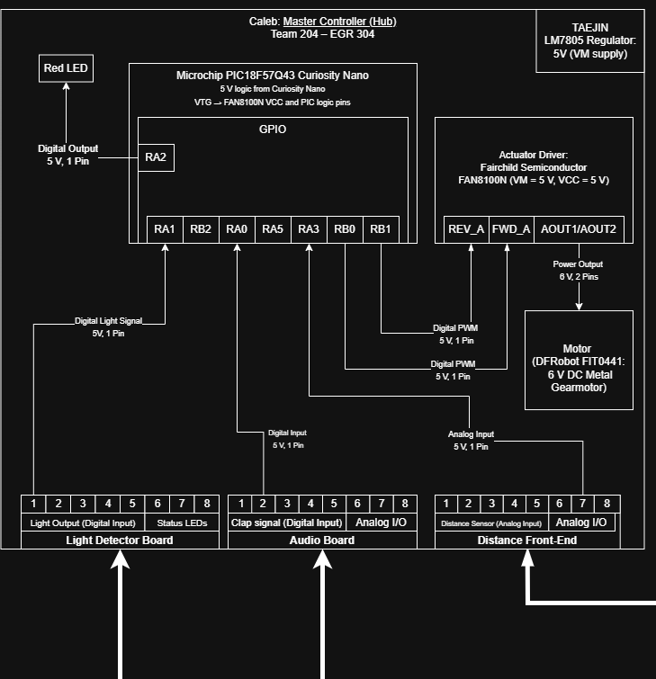

**Team 204 – Clap-Activated Smart Light**  
**Caleb Yuen – Master Controller (Hub)**  

## Overview
This page describes the hardware layout of my subsystem (Hub) for the team clap-activated light project. The Master Controller (PIC18F57Q43 Curiosity Nano) processes sensor data from the Audio, Light Sensor, and Sensor Front-End boards, then drives the actuator to control the LED output. The design uses an 8-pin ribbon-cable standard for consistent power and signal connections across all subsystems.

## Block Diagram 

**Microcontroller:** Microchip PIC18F57Q43 Curiosity Nano  

### Power Path
9 V DC input → LM7805 Regulator → 5 V system rail 
All logic runs at 5 V internally on the PIC.

### Inputs
| Source | Signal | MCU Pin | Type | Description |
|---------|---------|----------|-------|-------------|
| Light Sensor Board | RA1_LightOutput | RA1 | Digital In | Senses outside light to automatically shut off system |
| Audio Board | RA0_Clap_Signal | RA0 | Digital In | Detects clap events from Audio Front-End |
| Sensor Front-End | RA3_DIST_ADC | RA3 | Analog In | Measures ambient light levels for adaptive brightness  |

### Outputs
| Destination | Signal | MCU Pin | Type | Description |
|--------------|---------|----------|-------|-------------|
| (H-Bridge) | RB0_PWM_A / RB1_PWM_B | RB0 / RB1 | PWM Out | Controls motor speed and direction |
| Onboard | D1 (Red LED) | RA2 | Digital Out | Hub status indicator |

### Actuator Path
FAN8100N H-Bridge receives PWM inputs from RB0 & RB1 and drives the DFRobot FIT0441 6 V motor.  
Power pins PVC CA/B are fed by +5V and controlled through the PIC enable pin RA5.

## ** Connecting the Block Diagram to System Requirements **
Each block in the Hub diagram directly supports the team’s product requirements by turning sensor inputs into reliable, safe, and predictable system behavior. The PIC18F57Q43 processes clap, light, and distance signals in real time, which helps the system meet its accuracy and fast response requirements. The LM7805 power regulator keeps the entire design at a safe five volts, supporting the requirement for low-voltage operation and stable sensor readings. The clap input from the Audio Board drives the core function of detecting a valid user command, the light sensor input prevents the system from activating in bright environments, and the distance input enables adaptive brightness, all of which connect to the project’s usability and customization goals. On the output side, the PWM signals that feed the FAN8100N H-bridge allow the Hub to meet timing and durability requirements by controlling the motor smoothly and only when needed. The onboard status LED provides clear user feedback, supporting the requirement for simple interaction. Together, these elements show how the Hub fulfills the team’s expectations for safety, performance, and an intuitive user experience.
