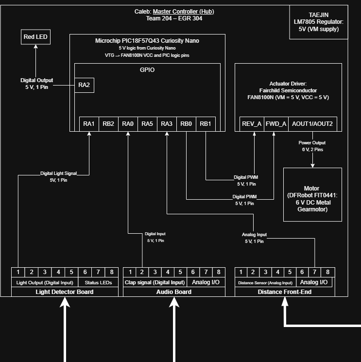

**Team 204 – Clap-Activated Smart Light**  
**Caleb Yuen – Master Controller (Hub)**  

## Overview
This page describes the hardware layout of my subsystem (Hub) for the team clap-activated light project. The Master Controller (PIC18F57Q43 Curiosity Nano) processes sensor data from the Audio, Filter, and Sensor Front-End boards, then drives the actuator to control the lamp output. The design uses an 8-pin ribbon-cable standard for consistent power and signal connections across all subsystems.

## Block Diagram 

**Microcontroller:** Microchip PIC18F57Q43 Curiosity Nano  

### 🔹 Power Path
9 V DC input → LM7805 Regulator → 5 V system rail (+5_SYS)  
All logic runs at 3.3 V internally on the PIC.

### 🔹 Inputs
| Source | Signal | MCU Pin | Type | Description |
|---------|---------|----------|-------|-------------|
| Audio Board | RA0_Clap_Signal | RA0 | Digital In | Detects clap events from Audio Front-End |
| Light Detector Board | RA4_LightOutput | RA4 | Digital In | Reads filtered light threshold signal |
| Light Detector Board | RB1_FilterToggle | RB1 | Digital In | Toggles lamp state |
| Distance Front-End | RA3_DIST_ADC | RA3 | Analog In | Reads distance sensor feedback |
| General | RA5_Analog/A-D | RA5 | Analog In | Auxiliary analog line for testing or filter signal |

### 🔹 Outputs
| Destination | Signal | MCU Pin | Type | Description |
|--------------|---------|----------|-------|-------------|
| Light Detector Board | RB2_STATUS_LED | RB2 | Digital Out | LED feedback to Filter Board |
| Distance Front-End (H-Bridge) | RB0_PWM_A / RB1_PWM_B | RB0 / RB1 | PWM Out | Controls motor speed and direction |
| Distance Front-End (H-Bridge) | RA5 (Motor STBY) | RA5 | Digital Out | Enables motor driver |
| Onboard | D1 (Red LED) | RA2 | Digital Out | Hub status indicator |

### 🔹 Actuator Path
FAN8100N H-Bridge receives PWM inputs from RB0 & RB1 and drives the DFRobot FIT0441 6 V motor.  
Power pins PVC CA/B are fed by +5_SYS and controlled through the PIC enable pin RA5.

---

## Notes
- Inter-board ribbon connectors use shared GND and +5_SYS.  
- Voltage dividers (10 kΩ / 20 kΩ) are used on incoming 5 V signals to protect 3.3 V PIC inputs.  