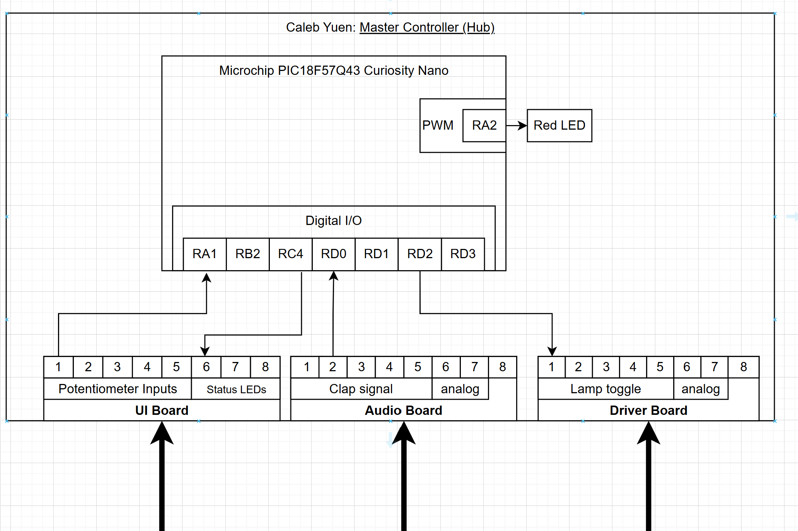

**Team 204 – Clap-Activated Smart Light**  
**Caleb Yuen – Master Controller (Hub)**  

## Overview
This page describes the hardware layout of my subsystem (Hub) for the team clap-light project.  
It shows how my PIC18F57Q43 Curiosity Nano connects to the Audio, Driver, and UI boards using the 8-pin ribbon-cable standard.

## Block Diagram 

*Figure 1: Subsystem block diagram for Master Controller.*

## Description
- **Microcontroller:** Microchip PIC18F57Q43 Curiosity Nano  
- **Inputs:** Clap signal (from Audio board), Button input (from UI board)  
- **Outputs:** Lamp toggle (to Driver board), Status LED (to UI board)  
- **Communication:** UART (TX/RX pins 1–2 on ribbon cable)  
- **Power:** +5 V VBUS from USB; distributed to other boards  

## Pin Assignment Table
| Connector | Pin | Signal | Direction | MCU Pin | Voltage |
|------------|-----|---------|------------|----------|----------|
| UI Board | 1 | TX | Hub → UI | RA1 | 3.3 V |
|  | 2 | RX | UI → Hub | RB2 | 3.3 V |
|  | 3 | Button Input | UI → Hub | RA1 | 3.3 V |
|  | 5 | Status LED | Hub → UI | RC4 | 3.3 V |
| Audio Board | 3 | Clap Signal | Audio → Hub | RD0 | 3.3 V |
| Driver Board | 3 | Lamp Toggle | Hub → Driver | RD2 | 3.3 V |

## Future Work
Next step: convert this block diagram into a detailed hardware schematic for my PCB.