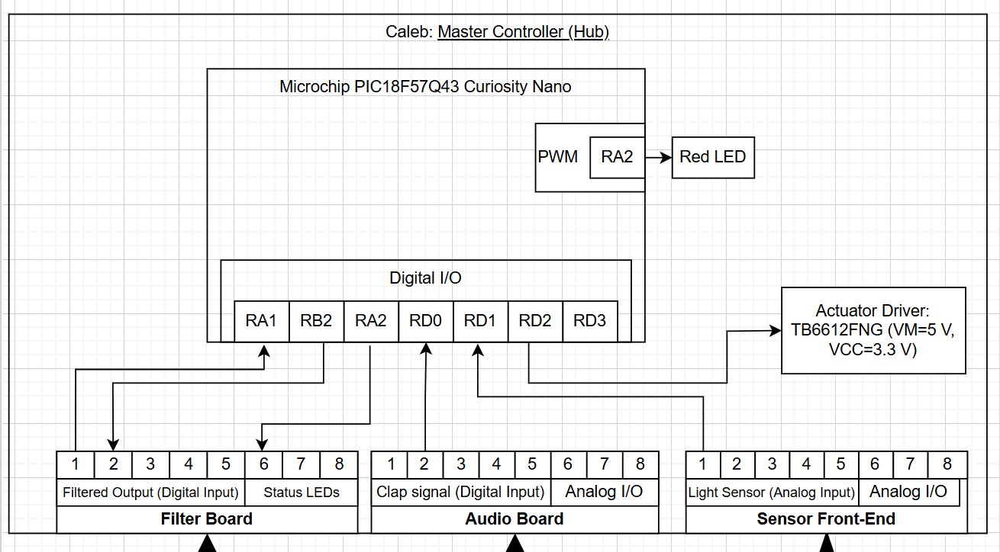

**Team 204 – Clap-Activated Smart Light**  
**Caleb Yuen – Master Controller (Hub)**  

## Overview
This page describes the hardware layout of my subsystem (Hub) for the team clap-activated light project. The Master Controller (PIC18F57Q43 Curiosity Nano) processes sensor data from the Audio, Filter, and Sensor Front-End boards, then drives the actuator to control the lamp output. The design uses an 8-pin ribbon-cable standard for consistent power and signal connections across all subsystems.

## Block Diagram 

**Microcontroller:** Microchip PIC18F57Q43 Curiosity Nano  

**Inputs:**
- Clap signal (from Audio board)
- Filter signal (from Filter board)
- Lamp toggle (from Filter board)

**Outputs:**
- Status LED (to Filter board)
- Heartbeat LED (on Hub)
- Actuator control to Sensor Front-End: `PWM_MOTOR`, `MOTOR_IN1`, `MOTOR_IN2`, `MOTOR_STBY`

**Communication:** Discrete GPIO over ribbon; no I²C in Rev 1.  
**Power:** 9 V DC in → 5 V (LM7805) → 3.3 V logic; common GND shared across all boards.

---

## Pin Assignment Table
| Pin | Signal              | Direction        | Source → Destination   | MCU Pin (PIC18F57Q43) | Voltage                | Notes                                   |
|-----|---------------------|------------------|------------------------|------------------------|------------------------|-----------------------------------------|
| 1   | GND                 | —                | —                      | —                      | 0 V                    | Common ground across all subsystems     |
| 2   | +5V_SYS             | —                | Power → All Boards     | —                      | 5 V                    | Regulated output from LM7805            |
| 3   | CLAP_IN             | Input            | Audio → Hub            | (assign pin)           | 3.3 V (via divider)    | Clap detection digital signal           |
| 4   | FILTER_SIGNAL_IN    | Input            | Filter → Hub           | (assign pin)           | 3.3 V (via divider)    | Filtered/threshold logic                |
| 5   | FILTER_TOGGLE       | Input            | Filter → Hub           | (assign pin)           | 3.3 V (via divider)    | Lamp toggle control                     |
| 6   | FILTER_STATUS_LED   | Output           | Hub → Filter           | (assign pin)           | 3.3 V                  | Status indicator LED                    |
| 7   | PWM_MOTOR           | Output (PWM)     | Hub → Sensor Front-End | (assign pin)           | 3.3 V                  | Dimming / speed control                 |
| 8   | MOTOR_STBY          | Output           | Hub → Sensor Front-End | (assign pin)           | 3.3 V                  | Enables actuator driver                 |
| 9   | MOTOR_IN1           | Output           | Hub → Sensor Front-End | (assign pin)           | 3.3 V                  | Direction control A                     |
| 10  | MOTOR_IN2           | Output           | Hub → Sensor Front-End | (assign pin)           | 3.3 V                  | Direction control B                     |
| 11  | GND                 | —                | —                      | —                      | 0 V                    | Interleaved ground for noise reduction  |
| 12  | UART_RX_FILTER      | Input (optional) | Filter → Hub (Debug)   | (assign pin)           | 3.3 V                  | Serial receive for Filter board         |
| 13  | UART_TX_FILTER      | Output (optional)| Hub → Filter (Debug)   | (assign pin)           | 3.3 V                  | Serial transmit to Filter board         |
| 14  | SPARE               | —                | —                      | —                      | —                      | Reserved for future use                 |

**Notes:**
- All PIC18F57Q43 logic operates at 3.3 V.  
- External 5 V signals are stepped down using 10 kΩ / 20 kΩ resistor dividers.  
- Only +5V_SYS and GND are shared between boards; interleave GND pins (1 and 11) in the ribbon to minimize noise.  
- UART pins (12–13) are optional for debugging with the Filter board.