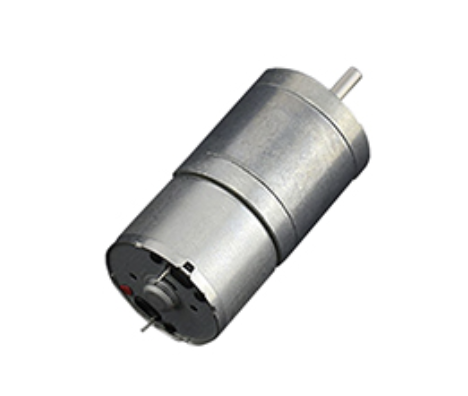
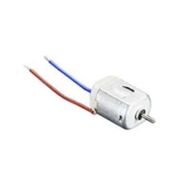
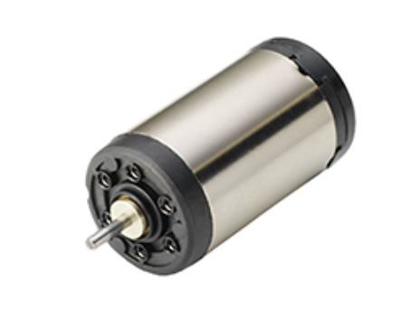

## Master Controller (HUB)

## **H-Bridge Motor Driver Options**
1. TB6612FNG

    

    * $1.82/each
    * [link to product](https://www.digikey.com/en/products/detail/toshiba-semiconductor-and-storage/TB6612FNG-C-8-EL/1730070)

    | Pros                                      | Cons                                                             |
    | ----------------------------------------- | ---------------------------------------------------------------- |
    | Works with 3.3 V logic, so it connects directly to the Hub without extra parts. | Can only handle about 1 amp continuously, so it’s not good for larger motors. |
    | Has built-in protection to prevent overheating or short circuits. | The small surface-mount chip is tricky to solder without a breakout board. |
    | Allows you to control two motors or use both sides together for more power. | The 3-amp peak rating only lasts a short time before the chip shuts down.

2. DRV8833

    

    * $2.62/each
    * [link to product](https://www.digikey.com/en/products/detail/texas-instruments/DRV8833PW/4251165)

    | Pros                                      | Cons                                                             |
    | ----------------------------------------- | ---------------------------------------------------------------- |
    | Works with 3.3 V control signals, making it compatible with the Hub. | Can get hot under heavy loads and needs good heat spreading on the PCB. |
    | Handles two motors and includes built-in protection for over-current, over-temperature, and undervoltage. | Only comes in surface-mount packages, so it’s not easy to use on a breadboard.|
    | Runs on 2.7–10.8 V, which fits perfectly in the project’s ≤9 V limit. | Needs a few extra small capacitors for stable operation, adding some circuit complexity.

3. 2156-FAN8100N-FS-ND

    

    * On-Hand
    * [link to product](https://www.digikey.com/en/products/detail/fairchild-semiconductor/FAN8100N/11558200)

    | Pros                                      | Cons                                                             |
    | ----------------------------------------- | ---------------------------------------------------------------- |
    | Works perfectly with your project’s 6–9 V motor supply and 3.3 V logic from the Hub. | Can only handle about 1.5 A per channel, which limits use to smaller motors. |
    | Has built-in protection features like thermal shutdown and short-circuit safety. | Older chip, no longer in production—can be harder to find replacements or breakout boards. |
    | Includes built-in diodes that protect against voltage spikes when motors switch direction.t | Has a basic control setup (Forward, Reverse, Brake); requires extra PWM programming for smooth speed control.

**Choice:** Option 3: 2156-FAN8100N-FS-ND

**Rationale:** The FAN8100N was chosen for its reliable 3.3 V logic compatibility, built-in protection features, and sufficient current capacity to safely and efficiently drive our 6 V DC motor within the Hub subsystem.

## **DC Motor Options**
1. FIT0495-A

    

    * $9.90/each
    * [link to product](https://www.digikey.com/en/products/detail/dfrobot/FIT0495-A/7087178)

    | Pros                                      | Cons                                                             |
    | ----------------------------------------- | ---------------------------------------------------------------- |
    | Uses very little current (~0.6 A stall), making it safe and easy for the TB6612FNG to drive. | Turns slowly (about 15 RPM), so it’s not good for fast-moving applications. |
    | Has high torque thanks to its metal gearbox; strong enough to press a button or lift small parts. | Can only handle up to 7.5 V, so it can’t use the full 9 V supply limit. |
    | Matches the system voltage (6–7.5 V) and provides smooth, controlled motion for precise actuation. | The gearbox has some mechanical play (backlash), which can cause small delays or looseness in movement.

2. Adafruit 711 – DC Toy Motor (130 Size)

    

    * $1.95/each
    * [link to product](https://www.digikey.com/en/products/detail/adafruit-industries-llc/711/5353610)

    | Pros                                      | Cons                                                             |
    | ----------------------------------------- | ---------------------------------------------------------------- |
    | Runs on 4.5–9 V, which fits perfectly within your project’s voltage range. | Has very low torque, so it’s not good for pushing, lifting, or heavy mechanical tasks. |
    | Fast and inexpensive, great for testing motion, vibration, or quick demos. | Comes without a gearbox or mount, so it’s harder to attach to an arm or mechanism. |
    | Draws less than 1 A, keeping it safe for the TB6612FNG driver. | Wears out quickly under long use, since it’s a small hobby motor designed for short runs.

3. Portescap 16G88-213E.1

    

    * $59.92/each
    * [link to product](https://www.digikey.com/en/products/detail/portescap/16G88-213E-1/5232856)

    | Pros                                      | Cons                                                             |
    | ----------------------------------------- | ---------------------------------------------------------------- |
    | Very efficient (≈84%), which means less heat, longer battery life, and smoother performance. | Expensive and harder to find since it’s a precision motor meant for specialized applications. |
    | Low current draw (~0.55 A) keeps it safe for the TB6612FNG driver and prevents overheating. | Low torque, so it can’t handle heavy loads unless paired with a gearbox. |
    | High build quality and smooth operation, great for precision control or demonstrations. | Requires custom mounting, since its small shaft and round body don’t fit standard brackets.

**Choice:** Option 1: DFRobot 6 V Metal Gearmotor (FIT0495-A)

**Rationale:** The DFRobot 6 V metal gearmotor was chosen for its high torque and low-speed output, providing smooth, controlled motion for pressing a button without bounce or damage. It operates safely on the project’s ≤ 9 V supply, draws under 1 A, and pairs perfectly with the FAN8100N H-Bridge, ensuring simple, reliable actuation with built-in protection and 3.3 V logic compatibility.

