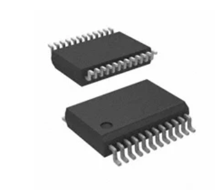
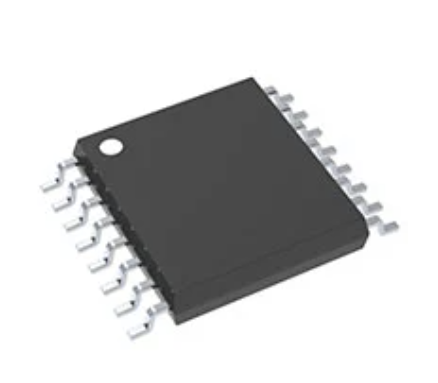
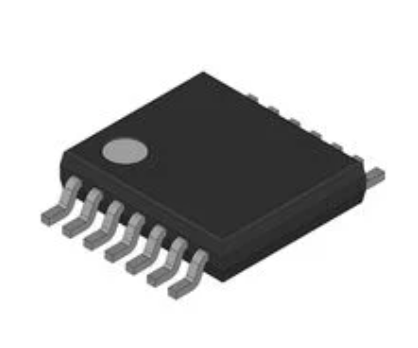

## **H-Bridge Motor Driver Options**
1. TB6612FNG

    

    * $1.82/each
    * [link to product](https://www.digikey.com/en/products/detail/toshiba-semiconductor-and-storage/TB6612FNG-C-8-EL/1730070)

    | Pros                                      | Cons                                                             |
    | ----------------------------------------- | ---------------------------------------------------------------- |
    | Works with 3.3 V logic, so it connects directly to the Hub without extra parts. | Can only handle about 1 amp continuously, so it’s not good for larger motors. |
    | Has built-in protection to prevent overheating or short circuits. | The small surface-mount chip is tricky to solder without a breakout board. |
    | Allows you to control two motors or use both sides together for more power. | The 3-amp peak rating only lasts a short time before the chip shuts down.

2. DRV8833

    

    * $2.62/each
    * [link to product](https://www.digikey.com/en/products/detail/texas-instruments/DRV8833PW/4251165)

    | Pros                                      | Cons                                                             |
    | ----------------------------------------- | ---------------------------------------------------------------- |
    | Works with 3.3 V control signals, making it compatible with the Hub. | Can get hot under heavy loads and needs good heat spreading on the PCB. |
    | Handles two motors and includes built-in protection for over-current, over-temperature, and undervoltage. | Only comes in surface-mount packages, so it’s not easy to use on a breadboard.|
    | Runs on 2.7–10.8 V, which fits perfectly in the project’s ≤9 V limit. | Needs a few extra small capacitors for stable operation, adding some circuit complexity.

3. 2156-FAN8100N-FS-ND

    

    * On-Hand
    * [link to product](https://www.digikey.com/en/products/detail/fairchild-semiconductor/FAN8100N/11558200)

    | Pros                                      | Cons                                                             |
    | ----------------------------------------- | ---------------------------------------------------------------- |
    | Works perfectly with your project’s 6–9 V motor supply and 3.3 V logic from the Hub. | Can only handle about 1.5 A per channel, which limits use to smaller motors. |
    | Has built-in protection features like thermal shutdown and short-circuit safety. | Older chip, no longer in production—can be harder to find replacements or breakout boards. |
    | Includes built-in diodes that protect against voltage spikes when motors switch direction.t | Has a basic control setup (Forward, Reverse, Brake); requires extra PWM programming for smooth speed control.

**Choice:** Option 1: Toshiba TB6612FNG

**Rationale:** TB6612FNG is the most practical, low-risk driver for a 6–9 V system controlled by a 3.3 V MCU. It gives you reliable bidirectional control, braking, and PWM speed control with simple wiring and strong community support.

> This is the example found in the assignment, uses more html

*Table 1: Example component selection*

**External Clock Module**

| **Solution**                                                                                                                                                                                      | **Pros**                                                                                                                                    | **Cons**                                                                                            |
| ------------------------------------------------------------------------------------------------------------------------------------------------------------------------------------------------- | ------------------------------------------------------------------------------------------------------------------------------------------- | --------------------------------------------------------------------------------------------------- |
|  Option 1.  XC1259TR-ND surface mount crystal $1/each [link to product](http://www.digikey.com/product-detail/en/ECS-40.3-S-5PX-TR/XC1259TR-ND/827366)                 | \* Inexpensive[^1] \* Compatible with PSoC \* Meets surface mount constraint of project                                               | \* Requires external components and support circuitry for interface \* Needs special PCB layout. |
|  \* Option 2.  \* CTX936TR-ND surface mount oscillator  \* $1/each  \* [Link to product](http://www.digikey.com/product-detail/en/636L3I001M84320/CTX936TR-ND/2292940) | \* Outputs a square wave  \* Stable over operating temperature   \* Direct interface with PSoC (no external circuitry required) range | * More expensive  \* Slow shipping speed                                                         |

**Choice:** Option 2: CTX936TR-ND surface mount oscillator

**Rationale:** A clock oscillator is easier to work with because it requires no external circuitry in order to interface with the PSoC. This is particularly important because we are not sure of the electrical characteristics of the PCB, which could affect the oscillation of a crystal. While the shipping speed is slow, according to the website if we order this week it will arrive within 3 weeks.

### Style 2

> Also acceptable, more markdown friendly

**External Clock Module**

1. XC1259TR-ND surface mount crystal

    

    * $1/each
    * [link to product](http://www.digikey.com/product-detail/en/ECS-40.3-S-5PX-TR/XC1259TR-ND/827366)

    | Pros                                      | Cons                                                             |
    | ----------------------------------------- | ---------------------------------------------------------------- |
    | Inexpensive                               | Requires external components and support circuitry for interface |
    | Compatible with PSoC                      | Needs special PCB layout.                                        |
    | Meets surface mount constraint of project |....

1. CTX936TR-ND surface mount oscillator

    

    * $1/each
    * [Link to product](http://www.digikey.com/product-detail/en/636L3I001M84320/CTX936TR-ND/2292940)

    | Pros                                                              | Cons                |
    | ----------------------------------------------------------------- | ------------------- |
    | Outputs a square wave                                             | More expensive      |
    | Stable over operating temperature                                 | Slow shipping speed |
    | Direct interface with PSoC (no external circuitry required) range |

**Choice:** Option 2: CTX936TR-ND surface mount oscillator

**Rationale:** A clock oscillator is easier to work with because it requires no external circuitry in order to interface with the PSoC. This is particularly important because we are not sure of the electrical characteristics of the PCB, which could affect the oscillation of a crystal. While the shipping speed is slow, according to the website if we order this week it will arrive within 3 weeks.
