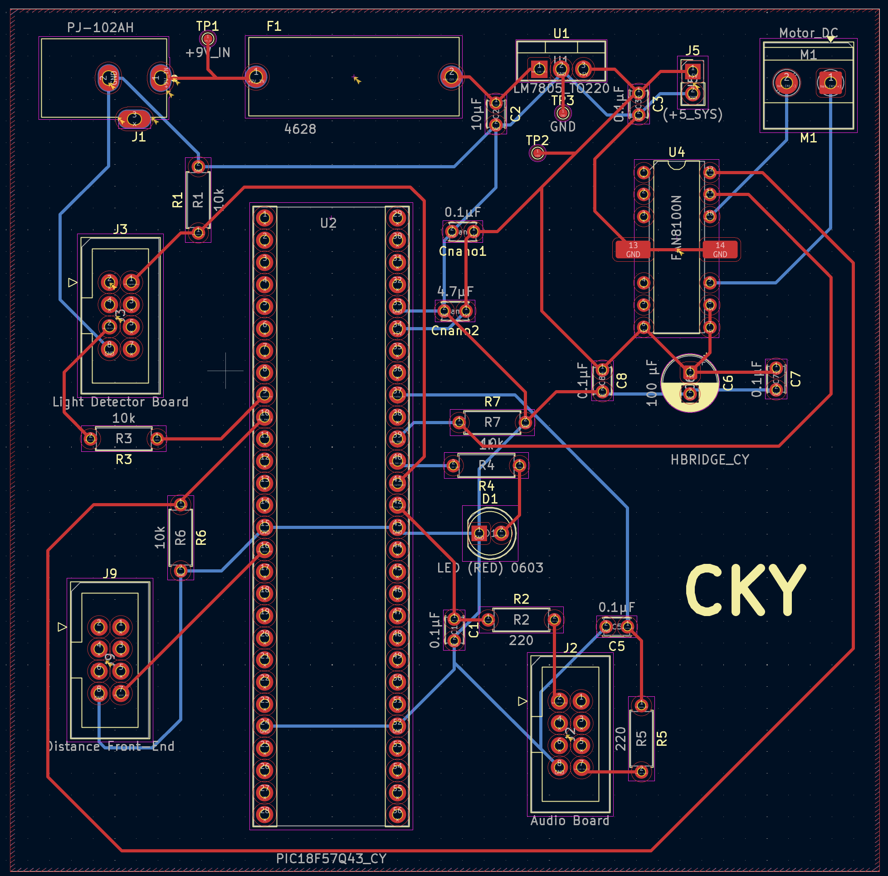

## Overview

This schematic shows the PIC18F57Q43 Curiosity Nano as the central controller for the ClapSense hub. It interfaces with three external subsystems — Filter Board, Audio Front-End, and Sensor Front-End — using 8-pin ribbon connectors.

The design includes a 9 V → 5 V LM7805 voltage regulator with fuse protection, a TB6612FNG motor driver for the actuator, and a 3.3 V logic interface between all boards. All power and signal connections align with the team block diagram and system design.

### Schematic Preview  

### PCB Preview  

### Downloads  
- [View full PDF schematic](C_Yuen_Hub_Schematic.pdf)  
- [Download KiCad project ZIP](C_Yuen_Hub_Project.zip)
- [Download PCB Gerber Files project ZIP](C_Yuen_Hub_GerberFiles.zip)

### Notes  
Logic voltage: 3.3 V (from PIC18F57Q43 VTG pin)
Motor driver supply: 5 V regulated from LM7805
Input: 9 V DC via barrel jack → Fuse → LM7805 → +5V_SYS rail
Outputs: +5V_SYS shared with all subsystems through 8-pin connectors
TB6612FNG handles motor drive and back-EMF internally
All grounds (GND) are shared across every subsystem

