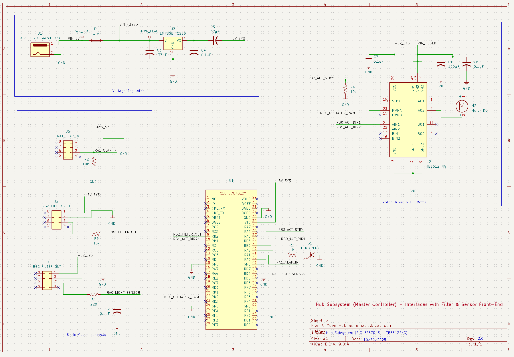

## Overview

This schematic shows the PIC18F57Q43 Curiosity Nano as the central controller for the ClapSense Hub.  
It interfaces with three external subsystems — the Audio Front-End, Light Sensor Board, and Sensor Front-End — using standardized 8-pin ribbon connectors.  

The design includes a 9 V → 5 V LM7805 voltage regulator with fuse protection, a FAN8100N H-Bridge motor driver for the actuator, and a 5 V logic interface between all boards.  
All power and signal connections align with the team block diagram and system-level design.

### Schematic Preview  

### Breadboard Design

 - HUB RA2 connects to Light Sensor Board
 - HUB RA0 connects to Audio Board
 - HUB RA3 connects to Sensor Front-End

### Downloads  
- [View full PDF schematic](C_Yuen_Hub_Schematic.pdf)  

### Notes  
- **Logic Voltage:** 5 V (from PIC18F57Q43 VTG pin)  
- **Motor Driver Supply:** 5 V regulated from LM7805  
- **Input Power:** 9 V DC via barrel jack → Fuse → LM7805 → +5V rail  
- **Outputs:** +5V  shared with all subsystems through 8-pin connectors  
- **Motor Driver:** FAN8100N handles bidirectional drive, braking, and back-EMF protection internally  
- **Grounds:** All GND nets are shared across every subsystem for common reference  

