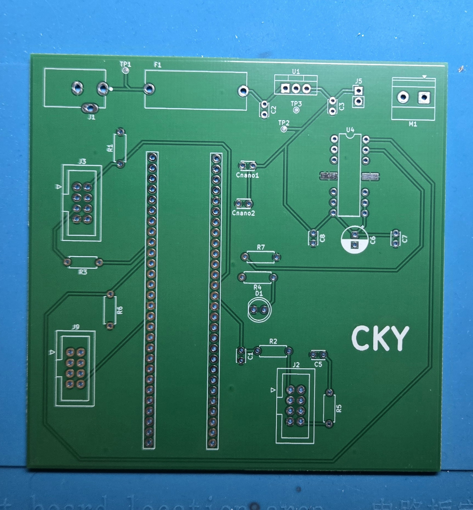
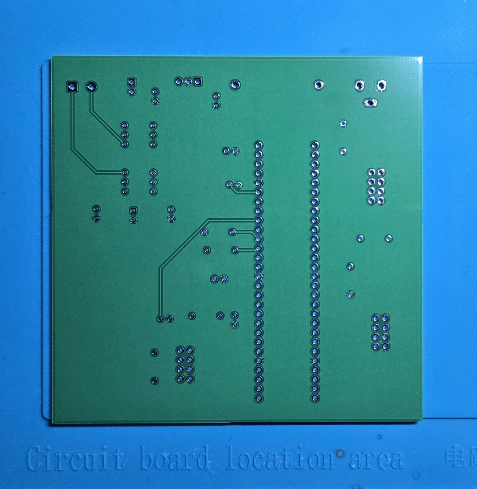
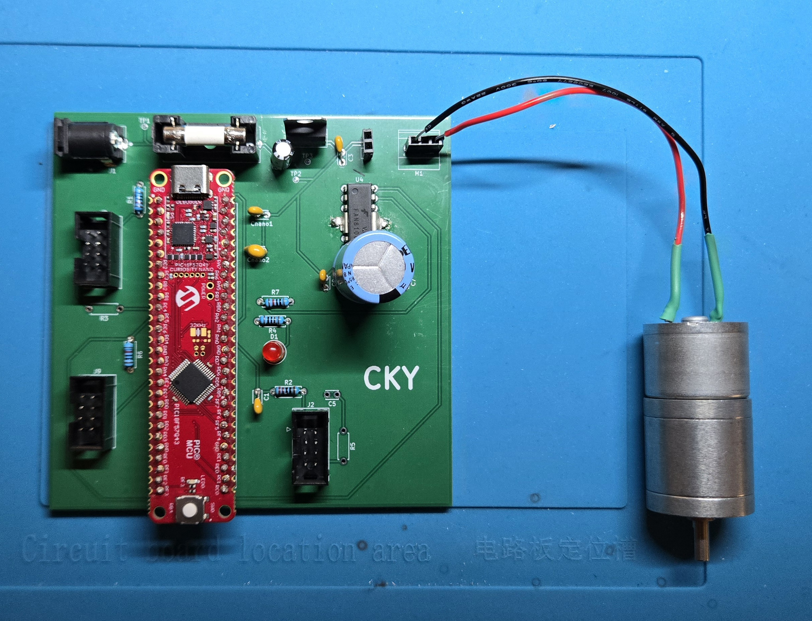
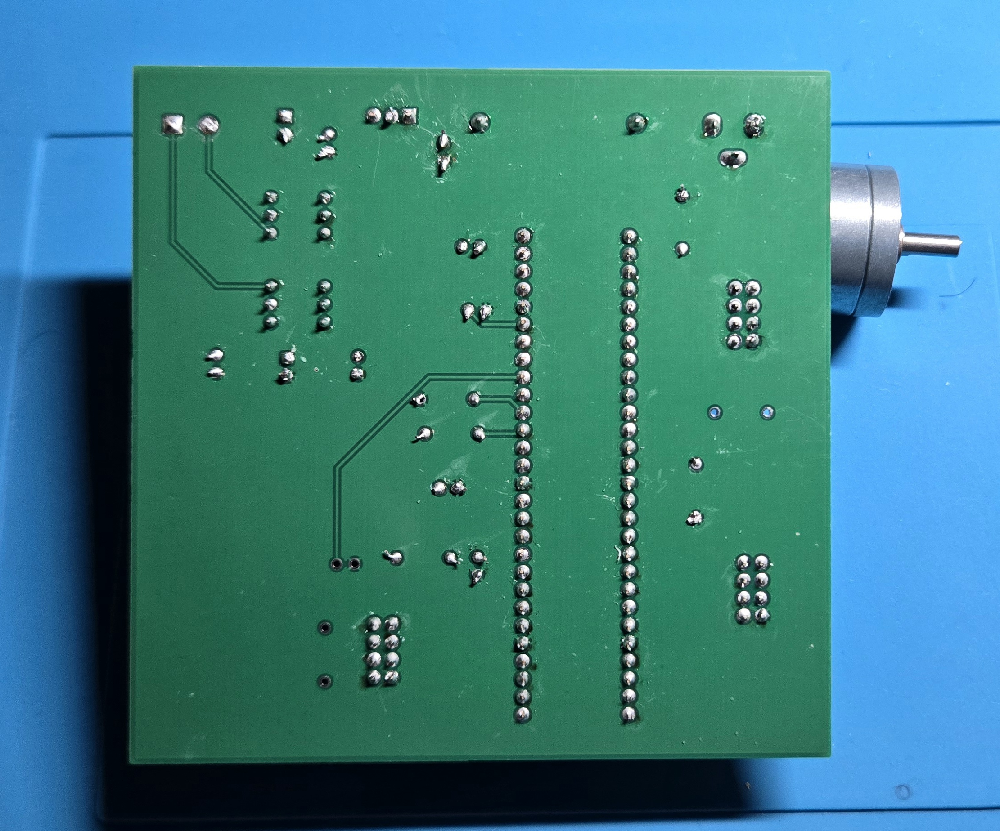

## Overview
This page documents the full PCB design process for the ClapSense Hub board. It includes the final routed layout in KiCad, the manufactured PCB from JLCPCB, and the fully assembled version with the PIC18F57Q43 Curiosity Nano and supporting components installed. The board connects to the Audio, Light Sensor, and Sensor Front-End subsystems through standardized headers and uses an onboard H-bridge to drive the system’s motor output. The images below show the evolution from digital layout to physical implementation, highlighting the final wiring, routing strategy, and connector placements used in the project.

### PCB Preview

### PCB Printed Design (Front)

### PCB Printed Design (Back)

### HUB Final Design (Front)

### HUB Final Design (Back)

**Note**
- R3, R5 and C5 were decided to be removed last minute that my team werent going give the hub analog input

### Downloads  
- [Download KiCad project ZIP](C_Yuen_Hub_Project.zip)
- [Download PCB Gerber Files project ZIP](C_Yuen_Hub_GerberFiles.zip)

