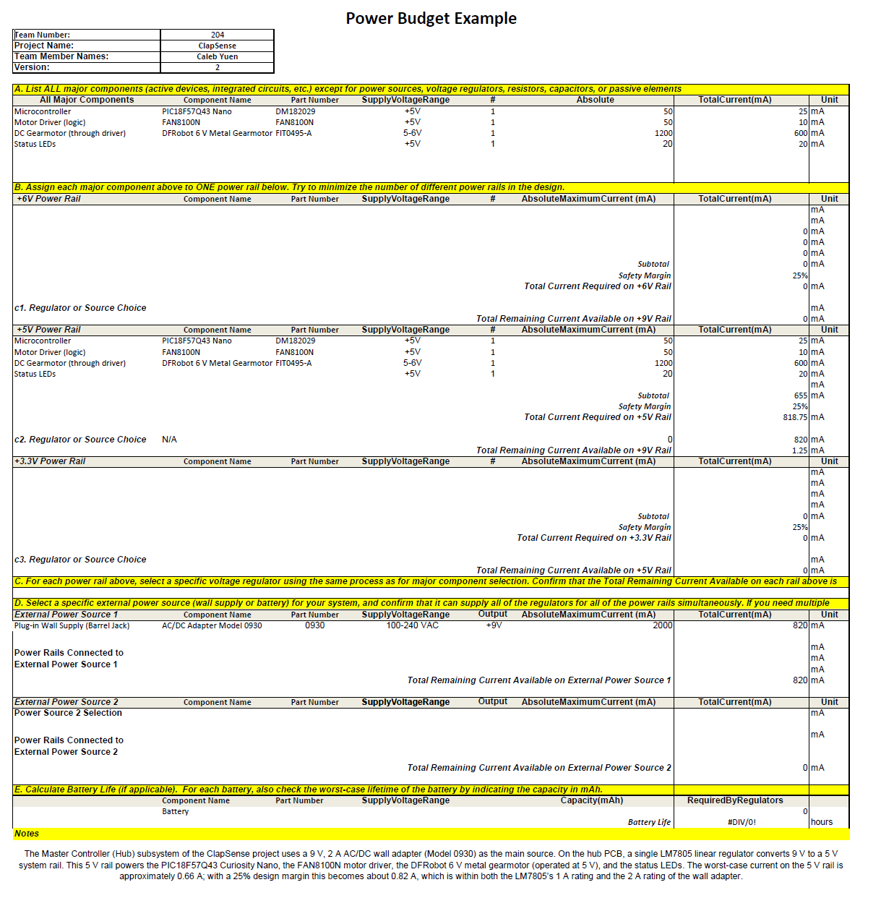

## Overview
This power budget summarizes the electrical needs of the ClapSense Hub based on the final hardware and spreadsheet results. The hub uses a 9 volt, 2 amp wall adapter that supplies an LM7805 linear regulator, which provides a stable 5 volt rail for the whole system. Every major part of the board, including the PIC18F57Q43 Curiosity Nano, the FAN8100N motor driver, the 6 volt gearmotor running at 5 volts, and the status LEDs, draws power from this regulator. When looking at the worst case numbers, the system uses around 655 milliamps. Adding a safety margin brings the expected requirement to about 820 milliamps. This is comfortably within the limits of both the LM7805 and the wall adapter, which means the board has plenty of room for startup surges, motor load changes, heat, and extra peripherals during testing. Overall, the final power analysis shows that the hub operates well within safe limits and has enough headroom for reliable performance.

### Power Budget 

## Downloads
The Power Budget template can be downloaded below:  

- [Power Budget (.xlsx)](EGR304-Team204-PowerBudget.xlsx)  
- [Power Budget (.pdf)](EGR304-Team204-PowerBudget.pdf) 
